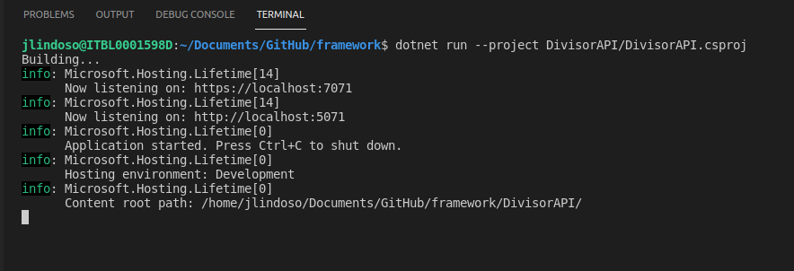
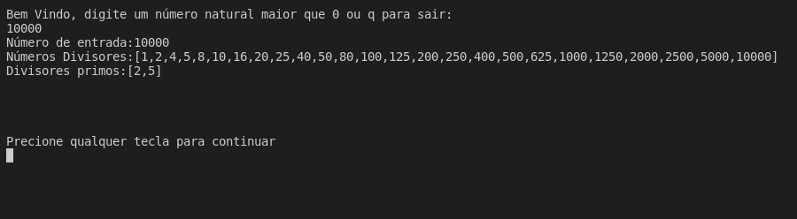
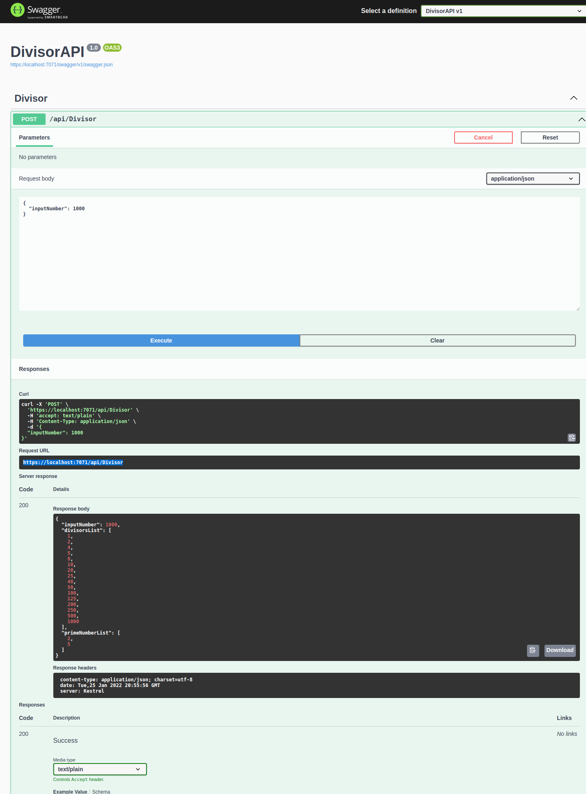

# Framework Desafio Técnico

  

## Descrição

Desafio proposto para fins avaliativos de processo seletivo na Framework definido por:

    1. Um cliente precisa de um sistema que seja capaz de decompor um número em todos os seus divisores, enumerando também aqueles que forem primos.

    Obs.: Não é permitido o uso de bibliotecas prontas, se houver, que façam a decomposição.

    ● Dado um número de entrada, o programa deve calcular todos os divisores que compõem o número.

    ● Dado um número de entrada, o programa deve calcular todos os divisores primos que compõem o número.

    Exemplo de Console:

    Digite um número: 45

    Após o usuário digitar o número, Console pode mostrar:

    Número de Entrada: 45

    Números divisores: 1 3 5 9 15 45

    Divisores Primos: 1 3 5

    1. Já temos nossa funcionalidade principal. Contudo, você acaba de descobrir que essa funcionalidade vai ser usada em outros sistemas e, por isso, é necessário que seja disponibilizada um serviço que forneça as informações. Fique atento a:

    ● Performance

    ● Escalabilidade

    ● Disponibilidade

    ● Resiliência

    ● Robustez

  

## Tecnologias Utilizadas

* ### .NET 6.0 lts

## Requisitos
* ### Instalação do .net core SDK 6
* ### Navegador Web (Preferencialmente Chrome)

## Execução Console

Após clonar o projeto entre na pasta "framework".

execute o seguinte codigo via terminal:

	dotnet run -p DivisorConsole/DivisorConsole.csproj 

## Execução API

Após clonar o projeto entre na pasta "framework".

execute o seguinte codigo via terminal:

	dotnet run --project DivisorAPI/DivisorAPI.csproj

Acesse o endereço disponibilizado, no caso da imagem é:  https://localhost:7071/swagger 

## Testes Unitários
Para executar os testes unitários utilize no terminal o seguinte código:

    dotnet test

## Modo de utilização Console

Digite um número para receber o resultado, caso deseje sair digite "q"

## Modo de utilização API

 Basta utilizar uma request do tipo POST para o endpoint Divisor.

    https://localhost:7071/api/Divisor

 Para documentação e fácil utilização pode ser usada a interface do swagger como no exemplo a seguir:

 
 

#### Arquitetura
* A arquitetura utilizada foi a "Onion Architecture",  Essa arquitetura fornece um ótimo suporte a testabilidade e manutenção.

* Na camada externa eu utilizo uma API (DivisorAPI) como interface de acesso a minhas funcionalidades. 

* Toda a regra de negócio é centralizada no projeto Businesslayer, nele divido as classes e serviços utilizados.

* Os testes unitários são realizados no projeto BusinessLayerTest.

    

#### Funcionalidade Divisor

Para chegar em um resultado performático, utilizei o espelhamento, faço a extração da raiz do número inputado, todo divisor a esquerda da raiz possui um correspondente a direita.
Removi o número 1 da lista de números primos, pois pela definição "Os números primos são os números naturais que podem ser divididos por apenas dois fatores" 